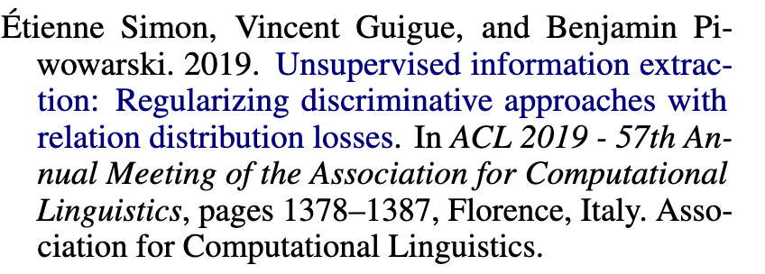

# Bib-normalizer: normalize your BibTex

## Function 

1.  Capitalize the title of each ref.
2.  Remove some redundant or useless attributes. e.g., url, doi.

## Usage

Put your `.bib` file under this folder (e.g., `test.bib`), then run the following command: 

```shell
python main.py --input test.bib --output test_cap.bib
```

By default, it will only remain some attributes (e.g., author, title). Change line 17 in the `main.py` according to your need.
## Demo

For example, there is a plain BibTex:

```bash
@inproceedings{simon:hal-02318233,
  TITLE = {Unsupervised Information Extraction: Regularizing Discriminative Approaches with Relation Distribution Losses},
  AUTHOR = {Simon, {\'E}tienne and Guigue, Vincent and Piwowarski, Benjamin},
  URL = {https://hal.archives-ouvertes.fr/hal-02318233},
  BOOKTITLE = {{ACL 2019 - 57th Annual Meeting of the Association for Computational Linguistics}},
  ADDRESS = {Florence, Italy},
  PUBLISHER = {{Association for Computational Linguistics}},
  PAGES = {1378-1387},
  YEAR = {2019},
  MONTH = Jul,
  DOI = {10.18653/v1/P19-1133},
  HAL_ID = {hal-02318233},
  HAL_VERSION = {v1},
}
```

After compiling, it looks like this below. Obviously, it is not very elegant because the first letters of some words in the title are not capitalized, and there is so much redundant information, e.g., `Florence, Italy`, `10.18653/v1/P19-1133`.



A normalized BibTex should be like this:

```bash
@inproceedings{simon:hal-02318233,
  TITLE = {{U}nsupervised {I}nformation {E}xtraction: {R}egularizing {D}iscriminative {A}pproaches with {R}elation {D}istribution {L}osses},
  AUTHOR = {Simon, {\'E}tienne and Guigue, Vincent and Piwowarski, Benjamin},
  BOOKTITLE = {{ACL 2019 - 57th Annual Meeting of the Association for Computational Linguistics}},
  PAGES = {1378-1387},
  YEAR = {2019},
}
```

You can find that all words in the title are capitalized, except for the prepositions. Some useless information has been removed. 

